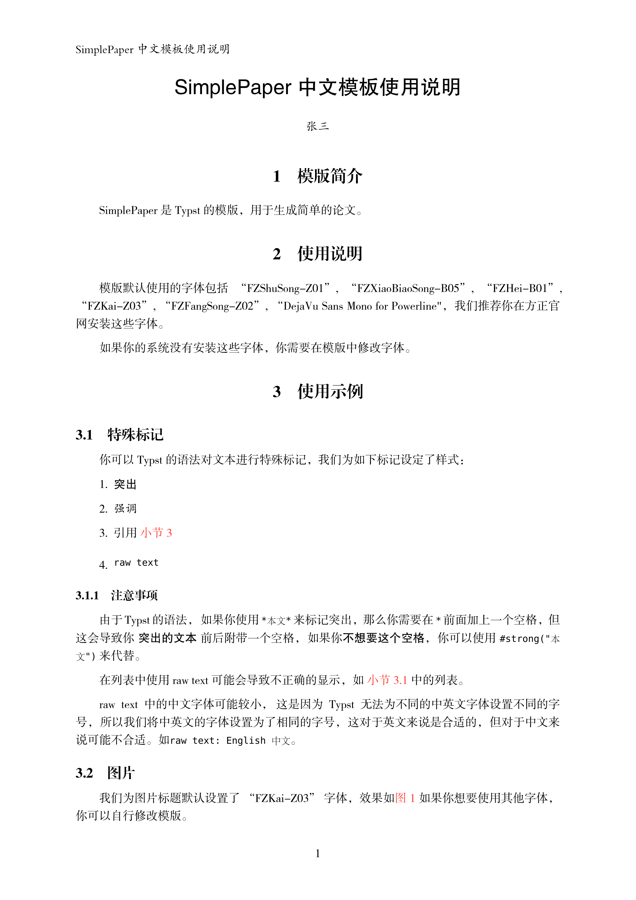
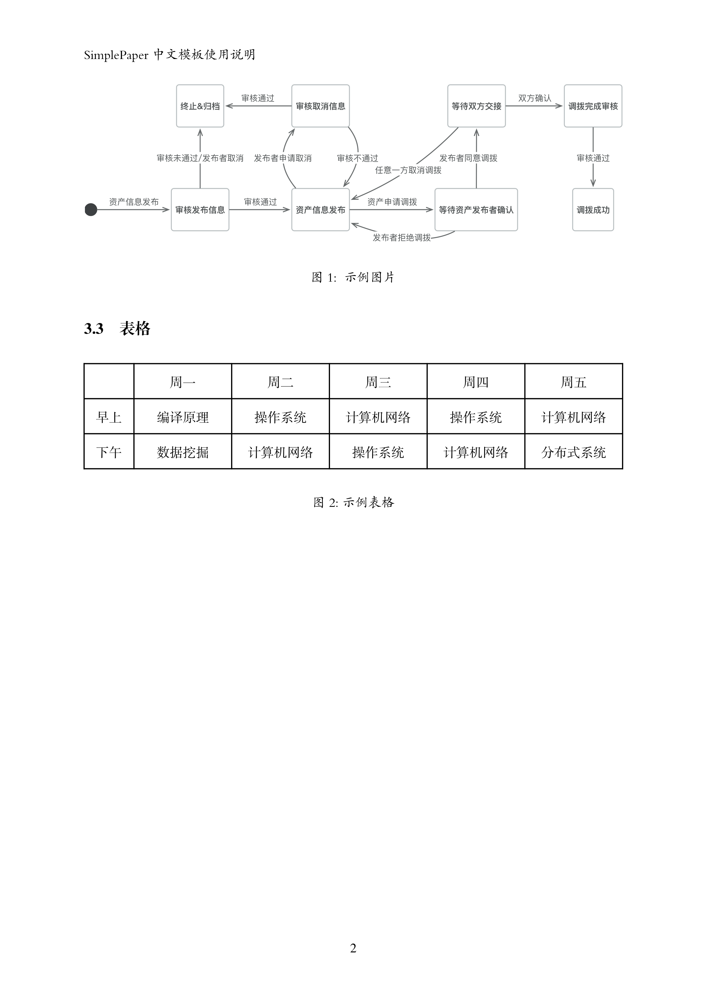

## 模版简介

SimplePaper 是 [Typst](https://github.com/typst/typst) 的模版，用于生成简单的论文。

## 使用说明

模版默认使用的字体包括 "FZShuSong-Z01", "FZXiaoBiaoSong-B05", "FZHei-B01", "FZKai-Z03", "DejaVu Sans Mono"，如果你在本地编译，需要在方正官网安装这些字体。

如果你的系统没有安装这些字体或想更换其他字体，你需要在模版中修改字体。

我们提供了一个 Typst 的[在线模板]("https://typst.app/project/rTNVUul26WZq12qs3kbD25")，你可以复制这个模板到你的工作区后在线编辑。**注意：由于模版包括了上述的字体文件，模板的大小可能较大。**

## 模版效果

