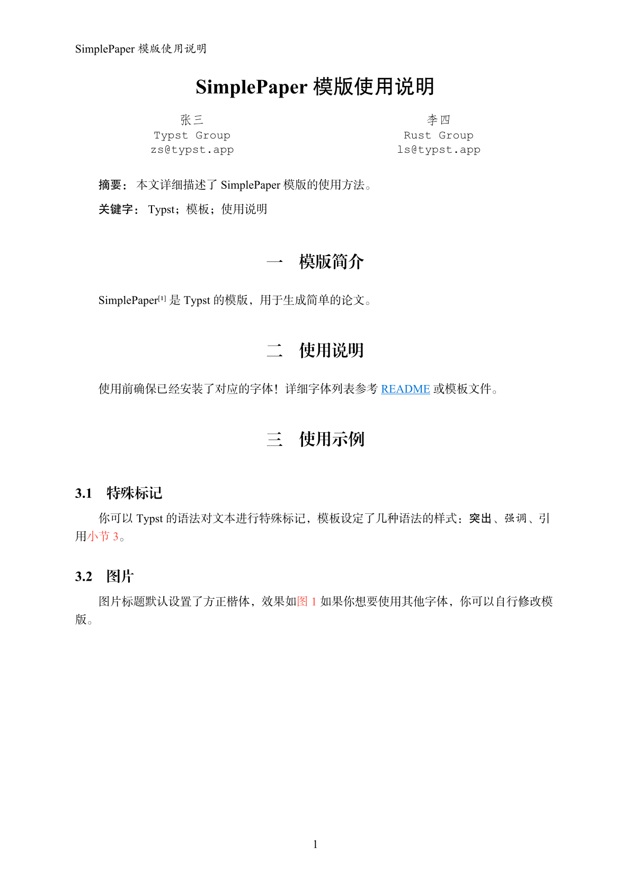
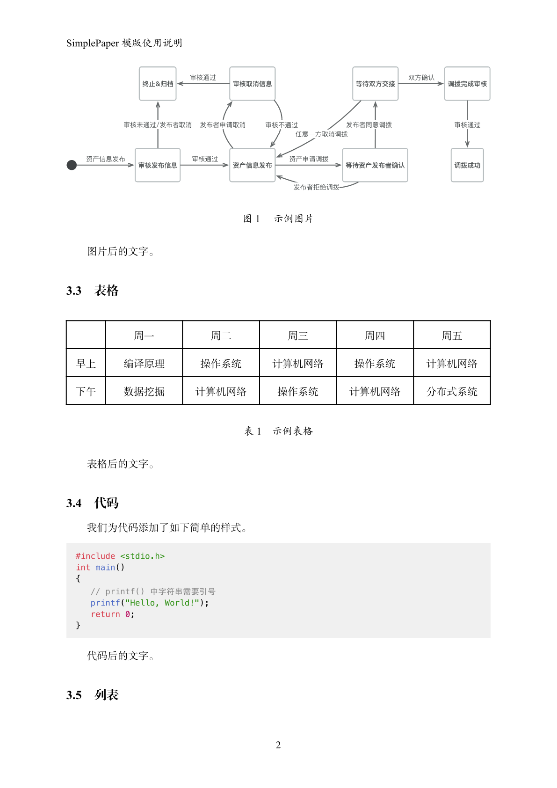
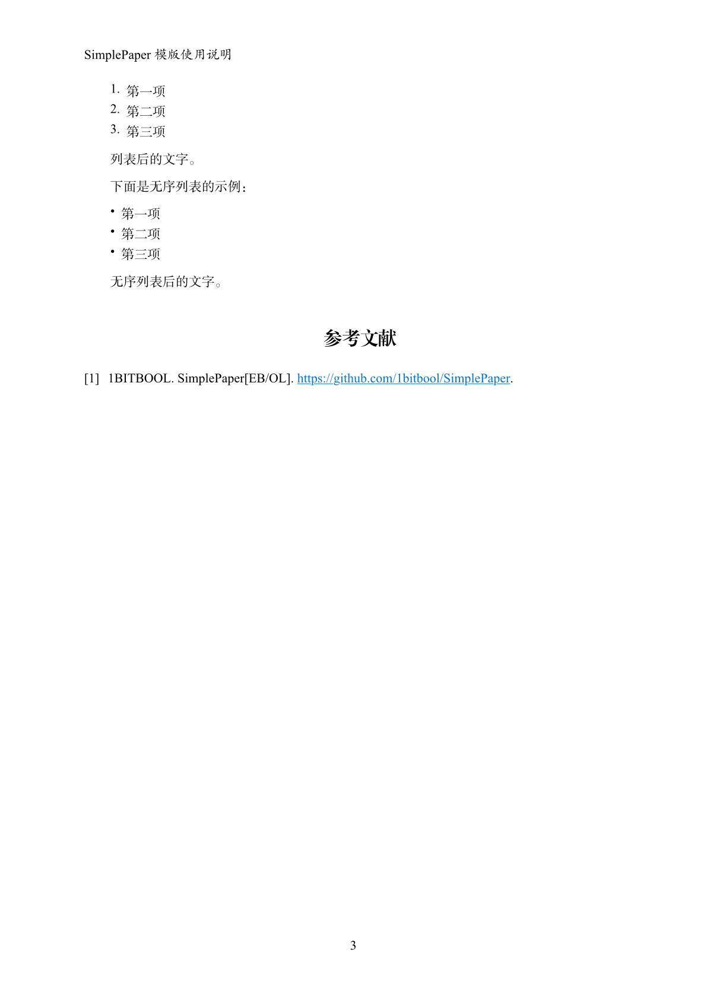
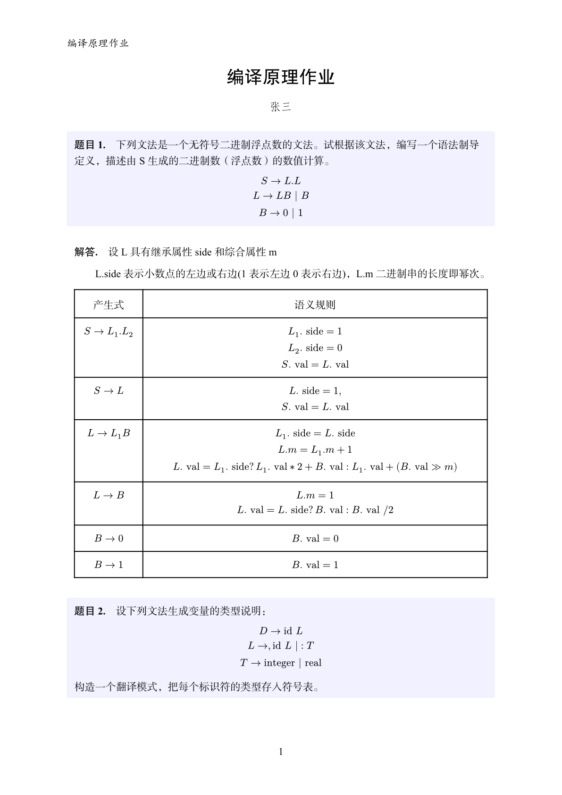
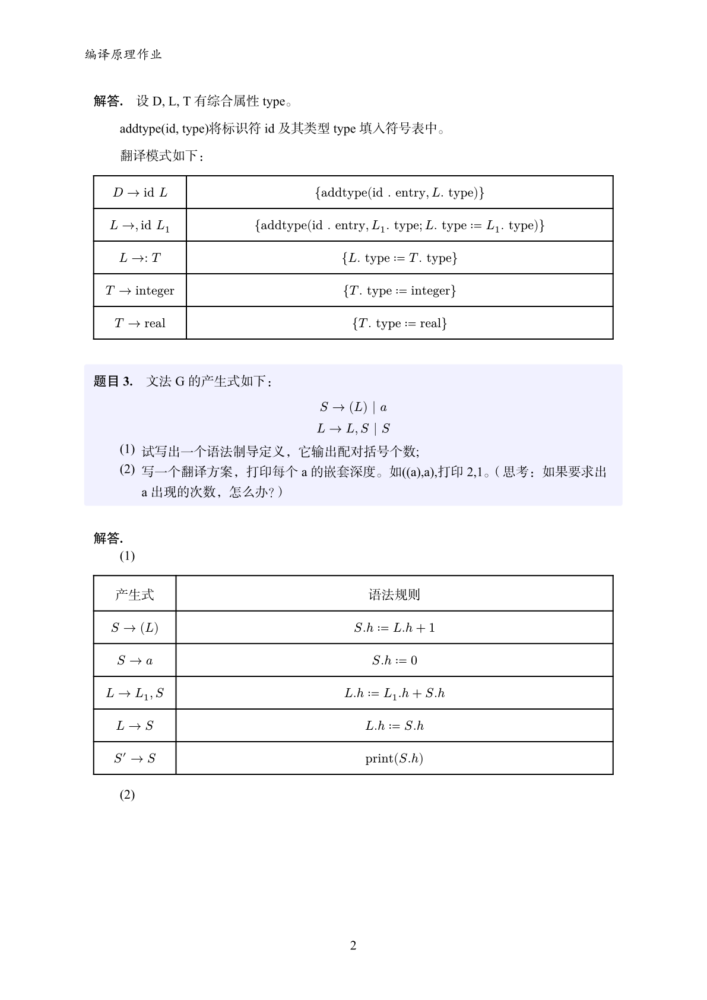
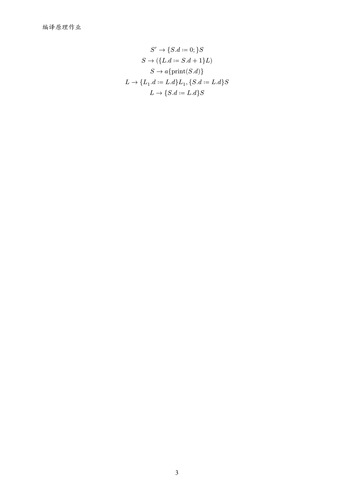

## 模版简介

SimplePaper 是 [Typst](https://github.com/typst/typst) 的模版，用于编写简单的论文/报告/作业。

## 使用说明

### 如何使用

下载 [simplepaper.typ](https://github.com/1bitbool/SimplePaper/blob/main/simplepaper.typ) 到本地，可以参考仓库中的示例 [论文示例](https://github.com/1bitbool/SimplePaper/blob/main/examples/example.typ) [作业示例](https://github.com/1bitbool/SimplePaper/blob/main/examples/homework.typ) 进行编写即可。

### 字体

使用前请先确认已经安装了模板所需字体！

当前模板的中文字体使用了 5 款方正字体：[方正黑体](https://www.foundertype.com/index.php/FontInfo/index/id/131)、[方正书宋](https://www.foundertype.com/index.php/FontInfo/index/id/151)、[方正楷体](https://www.foundertype.com/index.php/FontInfo/index/id/137)、[方正仿宋](https://www.foundertype.com/index.php/FontInfo/index/id/128)、[方正小标宋](https://www.foundertype.com/index.php/FontInfo/index/id/164)，你需要到[方正官网](https://www.foundertype.com/)安装这些字体。

模板英文字体使用了 "Georgia", "Times New Roman", "Courier New", "Menlo", 通常系统已经内置了这些字体，如发现异常可及时安装对应字体。

如果你想更换其他字体，你需要在模版中直接修改字体。

### 使用环境

由于网页版 Typst 没有内置这些中文字体，你需要手动上传字体以编译，这会导致每次打开模板的时候都会全量下载一遍字体。因此**不推荐在网页版上使用该模板**。

## 模版效果

### 论文效果

### 作业效果

